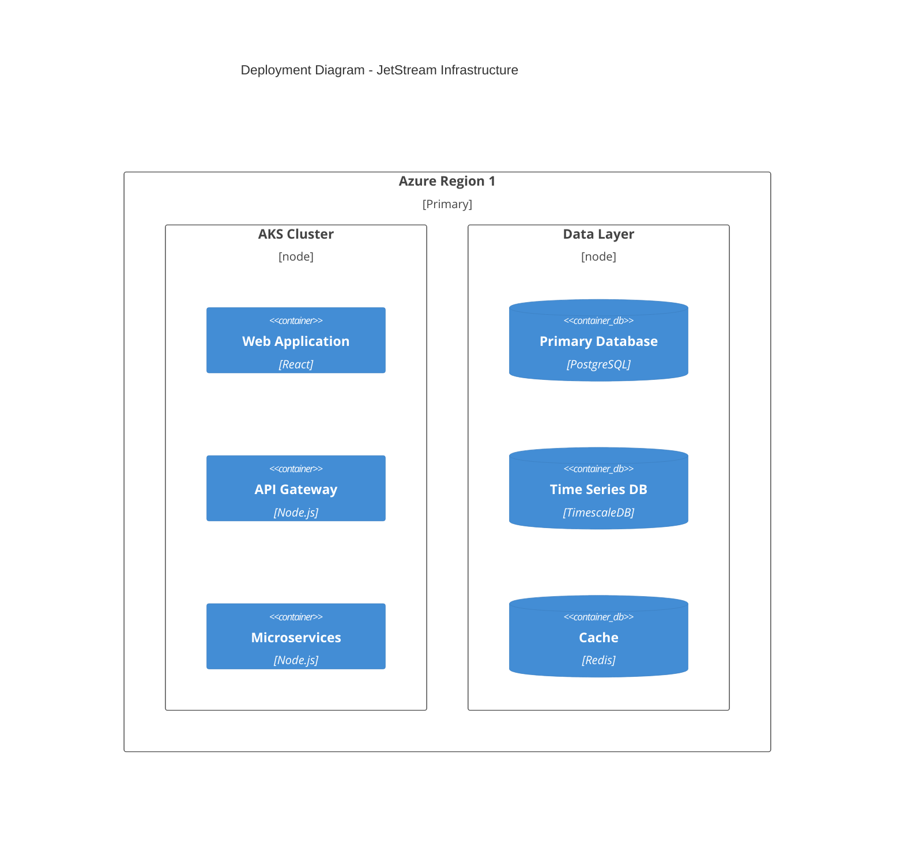

# JetStream Platform

[](https://dev.azure.com/flyusa/jetstream/_build/latest?definitionId=1)
[](https://dev.azure.com/flyusa/jetstream/_coverage)
[](./LICENSE)

JetStream is FlyUSA's next-generation aircraft tracking and trip management platform, designed to revolutionize operational efficiency and communication across the organization. The platform delivers real-time fleet visibility, streamlined trip management, and seamless integration with Microsoft Teams and FlyUSA's CRM.

## Key Features

- Real-time aircraft tracking via ADS-B
- Comprehensive trip status management
- Automated notification system
- Bidirectional CRM synchronization
- Teams integration for instant communication
- Role-based access control
- Enterprise-grade security

## System Architecture

```mermaid
C4Context
    title System Context Diagram - JetStream Platform

    Person(ops, "Operations Team", "Primary system users managing trips and updates")
    Person(sales, "Sales Team", "Views trip status and updates")
    Person(service, "Customer Service", "Monitors trip progress")

    System(jetstream, "JetStream Platform", "Aircraft tracking and trip management system")

    System_Ext(adsb, "ADS-B Provider", "Real-time aircraft position data")
    System_Ext(teams, "Microsoft Teams", "Notification and communication platform")
    System_Ext(crm, "FlyUSA CRM", "Customer and trip data management")

    Rel(ops, jetstream, "Updates trip status, monitors aircraft")
    Rel(sales, jetstream, "Views trip information")
    Rel(service, jetstream, "Monitors trip progress")
    
    Rel(jetstream, adsb, "Receives position data")
    Rel(jetstream, teams, "Sends notifications")
    Rel_Bidirectional(jetstream, crm, "Syncs trip data")
```

## Prerequisites

- Node.js 20 LTS
- Docker 24.x+
- Azure CLI
- Microsoft Teams admin access
- Azure subscription

## Getting Started

### Installation

```bash
# Clone the repository
git clone https://github.com/flyusa/jetstream.git
cd jetstream

# Install dependencies
npm install

# Configure environment
cp .env.example .env
# Edit .env with your configuration

# Start development environment
docker-compose up -d
```

### Environment Setup

```bash
# Configure Azure credentials
az login
az account set --subscription <subscription-id>

# Configure Teams integration
# Follow Teams app registration process in docs/teams-setup.md

# Initialize databases
npm run db:init

# Start development server
npm run dev
```

## Development

### Git Workflow

```bash
# Create feature branch
git checkout -b feature/your-feature-name

# Make changes and commit
git add .
git commit -m "feat: your feature description"

# Push changes
git push origin feature/your-feature-name

# Create pull request through GitHub interface
```

### Code Organization

```
jetstream/
├── src/
│   ├── api/          # API Gateway service
│   ├── tracking/     # Aircraft tracking service
│   ├── trip/         # Trip management service
│   ├── notification/ # Notification service
│   └── web/          # React frontend application
├── deploy/           # Deployment configurations
├── docs/            # Documentation
└── tests/           # Test suites
```

## Deployment



### Production Deployment

```bash
# Deploy to Azure
npm run deploy:prod

# Verify deployment
npm run verify:deployment

# Monitor deployment
npm run monitor:prod
```

## Operations

### Monitoring

- Application metrics: Azure Application Insights
- Infrastructure metrics: Azure Monitor
- Custom dashboards: Grafana
- Log analytics: Azure Log Analytics

### Performance Targets

- API Response Time: < 200ms (p95)
- Map Rendering Time: < 1s initial, < 100ms updates
- System Uptime: 99.9%
- Error Rate: < 0.1%

## Troubleshooting

### Common Issues

1. **Connection Issues**
   - Verify Azure credentials
   - Check network connectivity
   - Validate service endpoints

2. **Performance Issues**
   - Monitor resource utilization
   - Check database query performance
   - Verify cache hit rates

3. **Integration Issues**
   - Validate Teams configuration
   - Check CRM connectivity
   - Verify ADS-B data feed

## Contributing

Please read [CONTRIBUTING.md](CONTRIBUTING.md) for details on our code of conduct and development process.

## License

This project is licensed under the terms specified in [LICENSE](LICENSE).

## Support

For support:
1. Check documentation in `/docs`
2. Contact development team through Teams
3. Submit issue through GitHub
4. Email support@flyusa.com for urgent issues

---
Built with ❤️ by FlyUSA Engineering Team