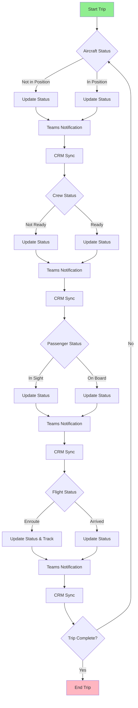
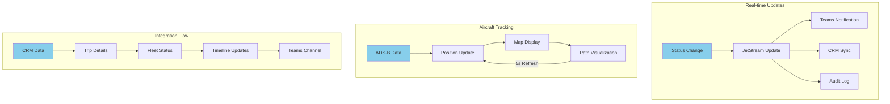
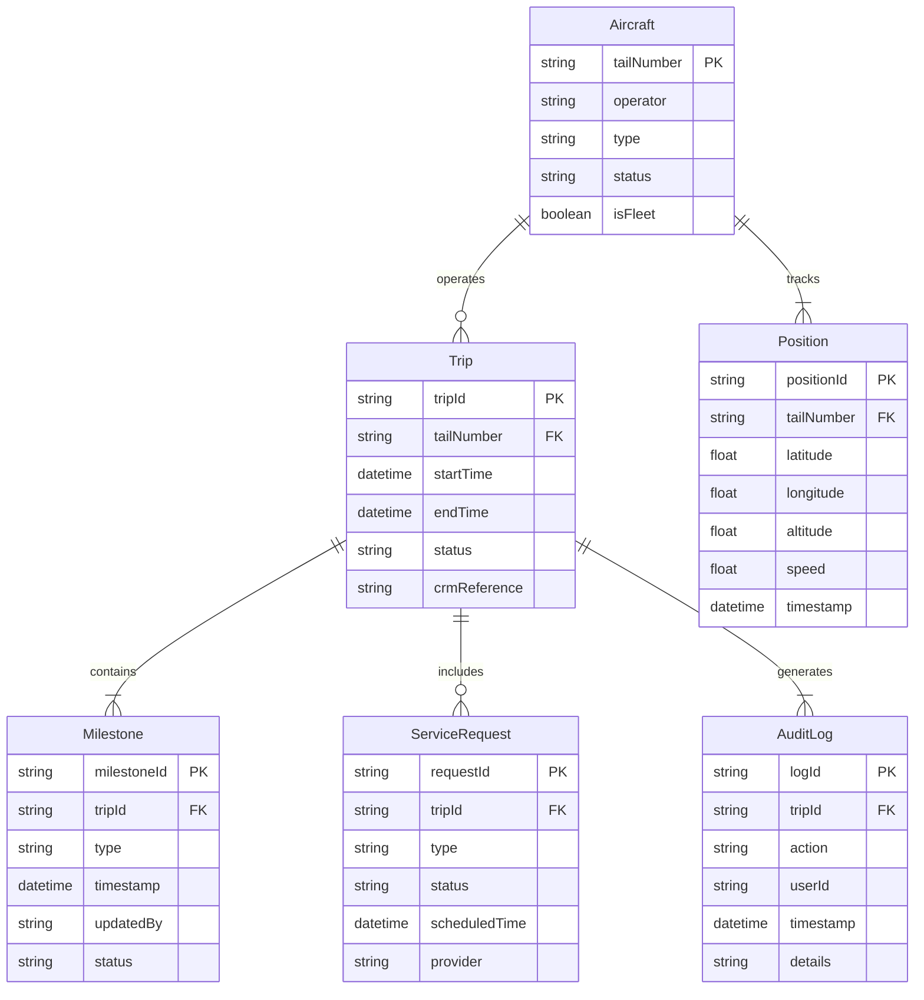
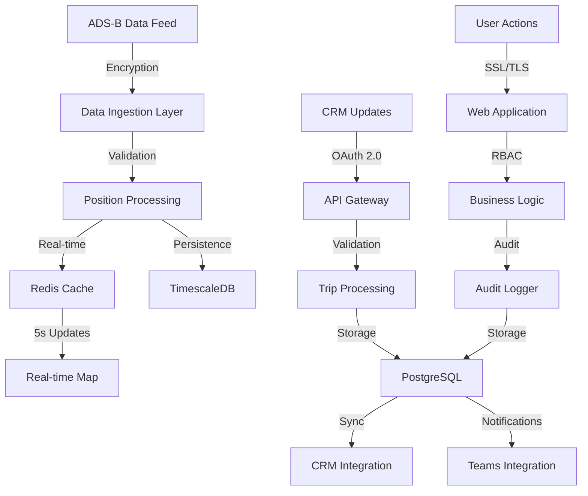
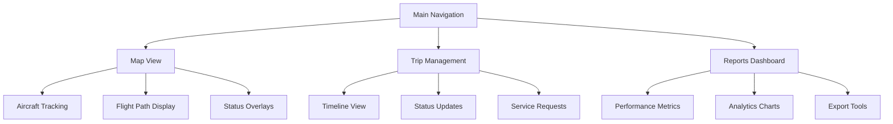
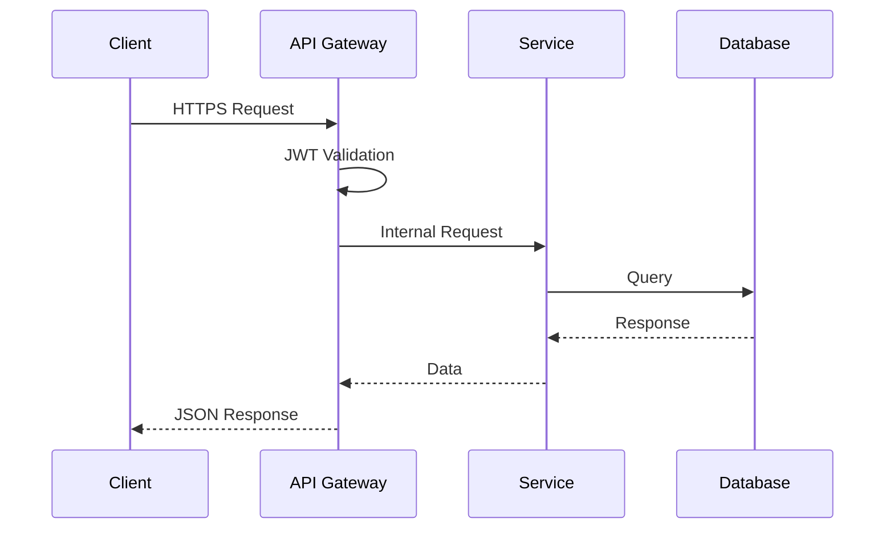

# Product Requirements Document (PRD)

# 1. INTRODUCTION

## 1.1 Purpose

This Software Requirements Specification (SRS) document provides a comprehensive description of the requirements for JetStream, FlyUSA's aircraft tracking and trip management system. It serves as the primary reference for technical and non-technical stakeholders including:

- Development and QA teams
- Project managers and system architects
- Operations and customer service teams
- Business stakeholders and leadership
- Integration partners and third-party vendors

## 1.2 Scope

JetStream is a real-time aircraft tracking and trip management platform designed to streamline FlyUSA's operational workflows and enhance communication across the organization. The system encompasses:

### Core Functionalities
- Real-time aircraft tracking using ADS-B data integration
- Comprehensive trip status management and milestone tracking
- Automated notifications and updates through Microsoft Teams
- Bidirectional synchronization with FlyUSA's CRM
- Fleet and partner operator visibility
- Audit logging and operational analytics

### Key Benefits
- Centralized operational control and visibility
- Enhanced cross-departmental communication
- Reduced manual data entry and human error
- Improved customer service through proactive updates
- Data-driven operational insights and reporting
- Streamlined workflow management

### System Boundaries
- Aircraft tracking within ADS-B coverage areas
- Integration with existing Microsoft Teams infrastructure
- CRM data synchronization via API
- User access based on FlyUSA's role-based permissions
- Mobile and desktop web browser accessibility

# 2. PRODUCT DESCRIPTION

## 2.1 Product Perspective

JetStream operates as a web-based platform within FlyUSA's broader operational ecosystem, integrating with several key systems:

- **ADS-B Data Provider**: Receives real-time aircraft positioning data
- **Microsoft Teams**: Delivers automated notifications and updates
- **FlyUSA CRM**: Maintains bidirectional synchronization of trip and customer data
- **Web Browsers**: Provides platform access across desktop and mobile devices
- **Role-based Access Control**: Leverages existing FlyUSA authentication systems

## 2.2 Product Functions

The primary functions of JetStream include:

1. **Aircraft Tracking**
   - Real-time position monitoring via ADS-B data
   - Visualization of planned vs. actual flight paths
   - 5-second refresh rate for active aircraft
   - Fleet and partner operator visibility

2. **Trip Management**
   - Milestone tracking and status updates
   - Automated notification distribution
   - Catering and ground transportation coordination
   - Real-time timeline management

3. **Integration Services**
   - Microsoft Teams channel updates
   - CRM data synchronization
   - Audit logging and tracking
   - Status change broadcasting

4. **Reporting and Analytics**
   - Operational performance metrics
   - Timeline adherence tracking
   - Service delivery analytics
   - Resource utilization reports

## 2.3 User Characteristics

### Operations Team
- Primary users of the system
- Technical proficiency: Intermediate
- Requires quick access to status updates and tracking
- Manages multiple trips simultaneously

### Sales Team
- Secondary users focused on trip status
- Technical proficiency: Basic to Intermediate
- Needs real-time visibility of customer trips
- Primarily consumes information via Teams notifications

### Customer Service Representatives
- Regular system users
- Technical proficiency: Intermediate
- Requires comprehensive trip visibility
- Focuses on proactive customer communication

### Management and Leadership
- Occasional system users
- Technical proficiency: Basic
- Needs high-level operational insights
- Primarily uses reporting and analytics features

## 2.4 Constraints

1. **Technical Constraints**
   - ADS-B coverage limitations in certain geographic areas
   - Web browser compatibility requirements
   - Mobile device responsive design requirements
   - API rate limits for external services

2. **Operational Constraints**
   - Real-time update requirements (< 5 second latency)
   - 24/7 system availability requirement
   - Multi-time zone support requirement
   - Audit trail retention requirements

3. **Security Constraints**
   - Role-based access control implementation
   - Data encryption requirements
   - Compliance with aviation data handling regulations
   - User activity monitoring requirements

## 2.5 Assumptions and Dependencies

### Assumptions
1. Users have access to modern web browsers
2. Stable internet connectivity at operational locations
3. Basic technical proficiency of all users
4. Availability of accurate ADS-B data
5. Continued support for current API versions

### Dependencies
1. ADS-B data provider service availability
2. Microsoft Teams infrastructure
3. FlyUSA CRM system uptime
4. Network connectivity between integrated systems
5. Browser compatibility with web technologies
6. Mobile device support for responsive design

# 3. PROCESS FLOWCHART

# 4. FUNCTIONAL REQUIREMENTS

## 4.1 Aircraft Tracking (AT)

### ID: AT-1
**Description**: Real-time aircraft position monitoring using ADS-B data  
**Priority**: High

| Requirement ID | Requirement Description | Acceptance Criteria |
|---------------|------------------------|-------------------|
| AT-1.1 | System shall display aircraft position on map interface | - Position updates every 5 seconds - Accurate within 100 meters - Displays altitude, speed, and heading |
| AT-1.2 | System shall visualize planned vs actual flight paths | - Dotted line for planned route - Solid line for actual path - Color-coded status indicators |
| AT-1.3 | System shall track both fleet and partner aircraft | - Distinct icons for fleet vs partner aircraft - Filtering options by operator - Status indicators for all tracked aircraft |

### ID: AT-2
**Description**: Aircraft status monitoring and updates  
**Priority**: High

| Requirement ID | Requirement Description | Acceptance Criteria |
|---------------|------------------------|-------------------|
| AT-2.1 | System shall monitor aircraft power status | - Active/inactive status indicators - Last known position retention - Power-on notifications |
| AT-2.2 | System shall track aircraft maintenance status | - Maintenance schedule integration - Status alerts for upcoming maintenance - Aircraft availability forecasting |

## 4.2 Trip Management (TM)

### ID: TM-1
**Description**: Comprehensive trip milestone tracking  
**Priority**: Critical

| Requirement ID | Requirement Description | Acceptance Criteria |
|---------------|------------------------|-------------------|
| TM-1.1 | System shall track all operational milestones | - All defined milestone states supported - Timestamp recording - User attribution for updates |
| TM-1.2 | System shall manage timeline updates | - Real-time timeline modifications - Conflict detection - Historical timeline retention |
| TM-1.3 | System shall coordinate ground services | - Catering status tracking - Transportation coordination - Service provider updates |

## 4.3 Integration Services (IS)

### ID: IS-1
**Description**: Microsoft Teams integration  
**Priority**: High

| Requirement ID | Requirement Description | Acceptance Criteria |
|---------------|------------------------|-------------------|
| IS-1.1 | System shall post status updates to Teams | - Real-time notification delivery - Formatted message content - Channel-specific routing |
| IS-1.2 | System shall include trip details in notifications | - Trip identifier inclusion - Status change details - Timestamp and user attribution |

### ID: IS-2
**Description**: CRM synchronization  
**Priority**: Critical

| Requirement ID | Requirement Description | Acceptance Criteria |
|---------------|------------------------|-------------------|
| IS-2.1 | System shall maintain bidirectional CRM sync | - Real-time data synchronization - Conflict resolution - Error handling and retry logic |
| IS-2.2 | System shall sync all trip-related data | - Customer details sync - Timeline synchronization - Service request updates |

## 4.4 Reporting and Analytics (RA)

### ID: RA-1
**Description**: Operational performance tracking  
**Priority**: Medium

| Requirement ID | Requirement Description | Acceptance Criteria |
|---------------|------------------------|-------------------|
| RA-1.1 | System shall generate performance reports | - Timeline adherence metrics - Service delivery statistics - Resource utilization data |
| RA-1.2 | System shall maintain audit logs | - Complete activity logging - User action tracking - Timestamp recording |
| RA-1.3 | System shall provide analytics dashboards | - Customizable metrics display - Real-time data updates - Export capabilities |

# 5. NON-FUNCTIONAL REQUIREMENTS

## 5.1 Performance Requirements

| ID | Requirement | Target Metric |
|----|------------|---------------|
| PER-1 | Map interface response time | < 2 seconds for initial load, < 500ms for updates |
| PER-2 | ADS-B data refresh rate | Every 5 seconds for active aircraft |
| PER-3 | Teams notification delivery | < 3 seconds from status change |
| PER-4 | CRM synchronization latency | < 5 seconds for bidirectional updates |
| PER-5 | Maximum concurrent users | Support 500 simultaneous users |
| PER-6 | Browser memory usage | < 512MB per active session |
| PER-7 | API response time | < 1 second for 95% of requests |

## 5.2 Safety Requirements

| ID | Requirement | Implementation |
|----|------------|----------------|
| SAF-1 | System failover | Automatic failover to backup servers within 30 seconds |
| SAF-2 | Data backup | Real-time replication with 15-minute point-in-time recovery |
| SAF-3 | Error handling | Graceful degradation with user notifications |
| SAF-4 | Data validation | Input validation for all user-entered data |
| SAF-5 | System monitoring | 24/7 automated monitoring with alert thresholds |
| SAF-6 | Recovery time objective | < 4 hours for full system recovery |
| SAF-7 | Recovery point objective | < 15 minutes of data loss in disaster scenarios |

## 5.3 Security Requirements

| ID | Requirement | Specification |
|----|------------|---------------|
| SEC-1 | Authentication | Multi-factor authentication integration with FlyUSA SSO |
| SEC-2 | Authorization | Role-based access control with granular permissions |
| SEC-3 | Data encryption | TLS 1.3 for transit, AES-256 for data at rest |
| SEC-4 | Session management | 30-minute timeout, secure session handling |
| SEC-5 | Audit logging | Comprehensive logging of all security events |
| SEC-6 | API security | OAuth 2.0 with JWT tokens for API access |
| SEC-7 | Data privacy | PII encryption and access controls |

## 5.4 Quality Requirements

### 5.4.1 Availability
- System uptime: 99.9% (excluding planned maintenance)
- Planned maintenance windows: Maximum 4 hours monthly
- Redundant infrastructure across multiple availability zones

### 5.4.2 Maintainability
- Modular architecture for component isolation
- Automated deployment processes
- Comprehensive system documentation
- Version control for all code and configurations

### 5.4.3 Usability
- Mobile-responsive design
- Maximum 3 clicks to reach any function
- Consistent UI/UX patterns
- Support for modern browsers (last 2 versions)
- Accessibility compliance with WCAG 2.1 Level AA

### 5.4.4 Scalability
- Horizontal scaling capability
- Auto-scaling based on load metrics
- Database partitioning support
- Microservices architecture support

### 5.4.5 Reliability
- Mean Time Between Failures (MTBF): > 720 hours
- Mean Time To Repair (MTTR): < 2 hours
- Error rate: < 0.1% of all transactions
- Data consistency checks every 24 hours

## 5.5 Compliance Requirements

| ID | Requirement | Standard/Regulation |
|----|------------|-------------------|
| COM-1 | Aviation data handling | FAA/EASA compliance |
| COM-2 | Data privacy | GDPR and CCPA compliance |
| COM-3 | Security standards | ISO 27001 compliance |
| COM-4 | Accessibility | WCAG 2.1 Level AA |
| COM-5 | API standards | REST/OpenAPI 3.0 compliance |
| COM-6 | Browser compatibility | W3C standards compliance |
| COM-7 | Audit requirements | SOC 2 Type II compliance |

# 6. DATA REQUIREMENTS

## 6.1 Data Models

## 6.2 Data Storage

### 6.2.1 Primary Storage
- PostgreSQL database cluster for transactional data
- TimescaleDB extension for time-series position data
- Redis cache layer for real-time position updates

### 6.2.2 Data Retention
| Data Type | Retention Period | Storage Type |
|-----------|-----------------|--------------|
| Trip Records | 7 years | PostgreSQL |
| Position Data | 90 days | TimescaleDB |
| Audit Logs | 3 years | PostgreSQL |
| Cache Data | 24 hours | Redis |
| Teams Notifications | 30 days | Archive Storage |

### 6.2.3 Redundancy and Backup
- Real-time replication across multiple availability zones
- Point-in-time recovery capability up to 15 minutes
- Daily full backups retained for 30 days
- Weekly backups retained for 1 year
- Monthly backups retained for 7 years

## 6.3 Data Processing

### 6.3.1 Data Security
| Layer | Security Measure |
|-------|-----------------|
| Transport | TLS 1.3 encryption |
| Storage | AES-256 encryption at rest |
| Application | Role-based access control |
| API | OAuth 2.0 with JWT |
| Database | Row-level security |

### 6.3.2 Data Processing Requirements
- Position data processing within 1 second of receipt
- Trip updates synchronized within 5 seconds
- Audit logging within 2 seconds of actions
- Real-time data validation before storage
- Automatic data archival based on retention policies

### 6.3.3 Data Integration
- REST APIs for CRM integration
- WebSocket feeds for real-time position updates
- Microsoft Graph API for Teams integration
- Batch processing for historical data analysis
- Event-driven architecture for real-time updates

# 7. EXTERNAL INTERFACES

## 7.1 User Interfaces

### 7.1.1 Web Application Interface

| Component | Requirements |
|-----------|--------------|
| Resolution Support | Minimum 1024x768, optimized for 1920x1080 |
| Responsive Design | Bootstrap 5 breakpoints for mobile/tablet/desktop |
| Color Scheme | High contrast for aviation visibility standards |
| Font Requirements | Sans-serif, minimum 12px, WCAG 2.1 compliant |
| Navigation | Maximum 3-click depth to any feature |

### 7.1.2 Core Interface Components

## 7.2 Hardware Interfaces

### 7.2.1 ADS-B Receiver Integration

| Interface | Specification |
|-----------|--------------|
| Data Format | Extended Squitter (1090 MHz) |
| Update Rate | 5 seconds |
| Position Accuracy | ±100 meters |
| Altitude Resolution | ±25 feet |

### 7.2.2 Client Hardware Requirements

| Component | Minimum Specification |
|-----------|---------------------|
| CPU | Dual-core 2.0 GHz |
| Memory | 4GB RAM |
| Network | 10 Mbps stable connection |
| Display | 1024x768 resolution |

## 7.3 Software Interfaces

### 7.3.1 External System Integration

| System | Interface Type | Protocol | Data Format |
|--------|---------------|----------|-------------|
| ADS-B Data Provider | REST API | HTTPS | JSON |
| Microsoft Teams | Graph API | HTTPS | JSON |
| FlyUSA CRM | REST API | HTTPS | JSON |
| SSO Provider | OAuth 2.0 | HTTPS | JWT |

### 7.3.2 Database Interfaces

| Database | Purpose | Connection Protocol |
|----------|---------|-------------------|
| PostgreSQL | Primary data storage | TCP/IP with TLS |
| TimescaleDB | Position data storage | TCP/IP with TLS |
| Redis | Real-time caching | TCP/IP with TLS |

## 7.4 Communication Interfaces

### 7.4.1 Network Protocols

| Protocol | Usage | Port |
|----------|-------|------|
| HTTPS | Web application access | 443 |
| WSS | Real-time updates | 443 |
| TLS 1.3 | Data encryption | Various |

### 7.4.2 API Specifications

### 7.4.3 Integration Message Formats

| Integration | Message Format | Sample Structure |
|-------------|---------------|------------------|
| Position Updates | `{"tailNumber": "N123AB", "lat": 40.7128, "lon": -74.0060, "alt": 30000, "speed": 450, "timestamp": "2024-01-01T12:00:00Z"}` |
| Status Updates | `{"tripId": "T123", "status": "ENROUTE", "updatedBy": "user@flyusa.com", "timestamp": "2024-01-01T12:00:00Z"}` |
| Teams Notifications | `{"channel": "ops-updates", "message": "Trip T123 status updated to ENROUTE", "details": {...}}` |

# 8. APPENDICES

## 8.1 GLOSSARY

| Term | Definition |
|------|------------|
| ADS-B | Automatic Dependent Surveillance-Broadcast, a surveillance technology where aircraft determine their position via satellite navigation and broadcast it periodically |
| Fleet Aircraft | Aircraft owned and operated directly by FlyUSA |
| Off-Fleet Aircraft | Partner operator aircraft scheduled for FlyUSA trips |
| Point-in-time Recovery | Database recovery capability that allows restoration to any specific moment in time |
| Role-based Access Control | Security approach restricting system access based on organizational roles |
| Timeline Adherence | Measurement of how closely actual trip events match planned schedules |
| Trip Milestone | Specific, trackable events within a trip's lifecycle |
| WebSocket | Communication protocol providing full-duplex communication channels over TCP |

## 8.2 ACRONYMS

| Acronym | Expansion |
|---------|-----------|
| API | Application Programming Interface |
| CCPA | California Consumer Privacy Act |
| CRM | Customer Relationship Management |
| EASA | European Union Aviation Safety Agency |
| FAA | Federal Aviation Administration |
| GDPR | General Data Protection Regulation |
| JWT | JSON Web Token |
| MTBF | Mean Time Between Failures |
| MTTR | Mean Time To Repair |
| PII | Personally Identifiable Information |
| REST | Representational State Transfer |
| RBAC | Role-Based Access Control |
| SOC | Service Organization Control |
| SSO | Single Sign-On |
| TLS | Transport Layer Security |
| UI/UX | User Interface/User Experience |
| WCAG | Web Content Accessibility Guidelines |
| WSS | WebSocket Secure |

## 8.3 ADDITIONAL REFERENCES

| Reference | Description | URL/Location |
|-----------|-------------|--------------|
| ADS-B Technical Specifications | Detailed technical requirements for ADS-B data integration | FAA.gov/ADS-B/Technical |
| Microsoft Teams Graph API | Documentation for Teams integration development | docs.microsoft.com/graph/teams-concept-overview |
| OAuth 2.0 Framework | Security protocol specifications for API authentication | oauth.net/2 |
| OpenAPI 3.0 Specification | REST API documentation standard | swagger.io/specification |
| TimescaleDB Documentation | Time-series database implementation guide | docs.timescale.com |
| WCAG 2.1 Guidelines | Web accessibility implementation standards | w3.org/WAI/WCAG21 |