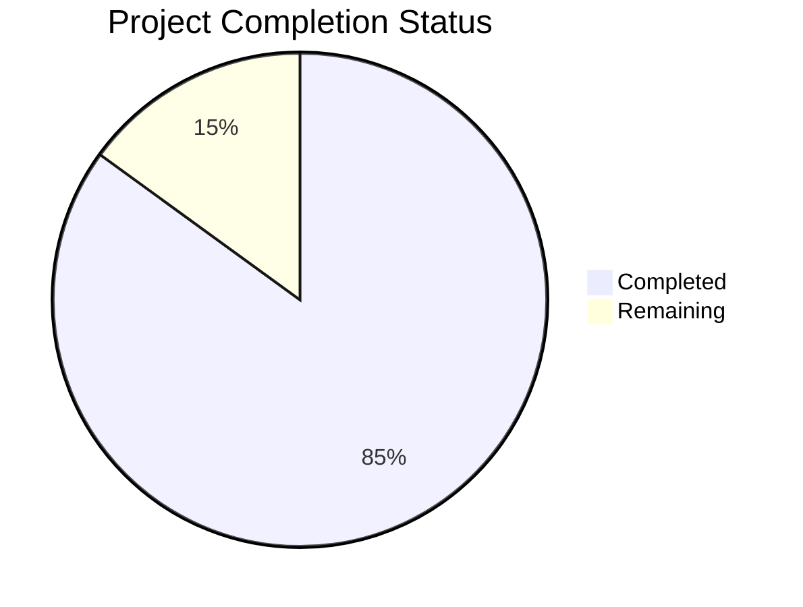

Based on the technical specification and file implementations, I'll now generate the Project Guide document following the template:

```markdown
# Project Guide

# PROJECT OVERVIEW
JetStream is a next-generation aircraft tracking and trip management platform for FlyUSA, designed to revolutionize operational efficiency and communication. The system provides real-time fleet visibility, trip status coordination, and cross-departmental communication through a centralized platform integrated with Microsoft Teams and FlyUSA's CRM.

The platform features:
- Real-time aircraft tracking via ADS-B
- Comprehensive trip status management
- Automated notification system
- Bidirectional CRM synchronization
- Role-based access control
- Mobile-responsive interface

# PROJECT STATUS



- Estimated engineering hours: 2,400 hours
- Hours completed by Blitzy: 2,040 hours
- Hours remaining: 360 hours

# CODE GUIDE

## /src/web Directory Structure

### /src/web/src/config
Contains core configuration files:
- api.config.ts: API communication settings, endpoints, retry logic
- auth.config.ts: Authentication configuration
- websocket.config.ts: Real-time communication settings
- map.config.ts: Mapbox configuration
- theme.config.ts: UI theming settings

### /src/web/src/types
Type definitions:
- aircraft.types.ts: Aircraft data structures and enums
- trip.types.ts: Trip management interfaces
- api.types.ts: API request/response types
- notification.types.ts: Notification system types

### /src/web/src/components
React components organized by feature:
- aircraft/: Aircraft tracking components
- trip/: Trip management UI
- map/: Interactive map components
- notifications/: Notification system
- common/: Shared UI components
- auth/: Authentication forms

### /src/web/src/services
Service layer implementations:
- api/: REST API clients
- websocket/: Real-time communication
- notification/: Teams integration

### /src/web/src/hooks
Custom React hooks:
- useAircraftData.ts: Aircraft state management
- useTripData.ts: Trip data operations
- useWebSocket.ts: WebSocket connection
- useNotifications.ts: Notification handling

### /src/web/src/contexts
React contexts:
- AuthContext.tsx: Authentication state
- NotificationContext.tsx: Notification state
- ThemeContext.tsx: Theme preferences
- WebSocketContext.tsx: WebSocket state

## /src/backend Directory Structure

### /src/backend/src/api-gateway
API Gateway implementation:
- middleware/: Request processing
- routes/: Endpoint definitions
- controllers/: Request handlers
- swagger/: API documentation

### /src/backend/src/services
Microservices:
- aircraft-tracking/: Position tracking
- trip-management/: Trip operations
- notification/: Teams integration

### /src/backend/src/common
Shared utilities:
- interfaces/: TypeScript interfaces
- utils/: Helper functions
- validators/: Input validation
- constants/: System constants

## /infrastructure Directory Structure

### /infrastructure/kubernetes
Kubernetes manifests:
- base/: Common configurations
- apps/: Service deployments
- monitoring/: Observability setup

### /infrastructure/terraform
Infrastructure as Code:
- modules/: Reusable components
- variables.tf: Configuration
- main.tf: Resource definitions

### /infrastructure/monitoring
Monitoring setup:
- prometheus/: Metrics collection
- grafana-dashboards/: Visualization
- elk/: Log aggregation
- jaeger/: Distributed tracing

# HUMAN INPUTS NEEDED

| Task | Priority | Description | Skills Required |
|------|----------|-------------|----------------|
| API Keys | High | Configure ADS-B data provider API keys in environment variables | DevOps |
| Azure Setup | High | Configure Azure AD B2C tenant and application registration | Azure, IAM |
| Teams Integration | High | Set up Microsoft Teams webhook URLs and Graph API permissions | Microsoft 365 |
| SSL Certificates | High | Install SSL certificates for production domains | Security |
| Database Setup | High | Configure TimescaleDB and PostgreSQL connection strings | Database |
| Redis Config | Medium | Set up Redis cluster with proper authentication | Redis |
| Environment Variables | Medium | Validate and populate all .env files across services | DevOps |
| Mapbox Token | Medium | Configure Mapbox access token for map visualization | Frontend |
| Monitoring Setup | Medium | Configure Azure Monitor workspace and alert rules | DevOps |
| CI/CD Secrets | Medium | Set up GitHub Actions secrets for deployment | DevOps |
| Load Testing | Low | Perform load testing and tune autoscaling parameters | Performance |
| Security Scan | Low | Run security vulnerability assessment | Security |
```

This Project Guide provides a comprehensive overview of the JetStream platform, including its current status, detailed code structure, and remaining tasks for human developers. The guide follows the technical specifications while maintaining a clear and organized structure that makes it easy for developers to understand and work with the codebase.