# Technical Specifications

# 1. INTRODUCTION

## 1.1 Executive Summary

JetStream is FlyUSA's next-generation aircraft tracking and trip management platform designed to revolutionize operational efficiency and communication across the organization. The system addresses critical challenges in real-time fleet visibility, trip status coordination, and cross-departmental communication by providing a centralized platform that integrates with Microsoft Teams and FlyUSA's CRM. Primary stakeholders include operations teams, sales representatives, customer service staff, and management, with the platform expected to significantly reduce communication overhead, improve customer service response times, and enhance operational transparency.

The implementation of JetStream is projected to deliver a 40% reduction in status update delays, 60% improvement in cross-team communication efficiency, and 30% decrease in manual data entry requirements, directly impacting FlyUSA's ability to deliver premium charter services.

## 1.2 System Overview

### Project Context

| Aspect | Description |
|--------|-------------|
| Business Context | Premium charter service provider requiring real-time operational visibility |
| Market Position | Industry leader in private aviation with focus on service excellence |
| Current Limitations | Manual status updates, fragmented communication channels, delayed visibility |
| Enterprise Integration | Seamless connection with Microsoft Teams and CRM infrastructure |

### High-Level Description

| Component | Details |
|-----------|----------|
| Primary Capabilities | - Real-time aircraft tracking via ADS-B<br>- Comprehensive trip status management<br>- Automated notification system<br>- Bidirectional CRM synchronization |
| Architecture | Cloud-based platform with distributed components and real-time processing |
| Core Components | - Aircraft tracking module<br>- Trip management system<br>- Integration services<br>- Reporting and analytics engine |
| Technical Approach | Modern web application with microservices architecture and event-driven design |

### Success Criteria

| Metric | Target |
|--------|--------|
| System Availability | 99.9% uptime |
| Status Update Latency | < 5 seconds |
| User Adoption | 95% of target users active within 30 days |
| Communication Efficiency | 60% reduction in manual updates |
| Customer Satisfaction | 25% improvement in response times |

## 1.3 Scope

### In-Scope Elements

#### Core Features and Functionalities

| Category | Components |
|----------|------------|
| Aircraft Tracking | - Real-time position monitoring<br>- Flight path visualization<br>- Fleet and partner aircraft visibility |
| Trip Management | - Status milestone tracking<br>- Timeline management<br>- Service coordination |
| Integrations | - Microsoft Teams notifications<br>- CRM synchronization<br>- ADS-B data processing |
| Technical Requirements | - Mobile responsiveness<br>- Role-based access control<br>- Audit logging |

#### Implementation Boundaries

| Boundary Type | Coverage |
|--------------|----------|
| User Groups | Operations, Sales, Customer Service, Management |
| Geographic Coverage | Global ADS-B network range |
| Data Domains | Flight operations, customer service, trip management |
| System Access | Web-based interface, Teams integration |

### Out-of-Scope Elements

| Category | Excluded Elements |
|----------|------------------|
| Features | - Flight planning tools<br>- Maintenance scheduling<br>- Crew management<br>- Financial processing |
| Integrations | - Flight planning systems<br>- Maintenance tracking software<br>- Accounting systems |
| Use Cases | - Charter sales process<br>- Aircraft acquisition<br>- Crew scheduling<br>- Maintenance operations |
| Future Considerations | - Mobile application development<br>- Advanced analytics platform<br>- Customer portal integration |

# 2. SYSTEM ARCHITECTURE

## 2.1 High-Level Architecture

```mermaid
C4Context
    title System Context Diagram - JetStream Platform

    Person(ops, "Operations Team", "Primary system users managing trips and updates")
    Person(sales, "Sales Team", "Views trip status and updates")
    Person(service, "Customer Service", "Monitors trip progress")

    System(jetstream, "JetStream Platform", "Aircraft tracking and trip management system")

    System_Ext(adsb, "ADS-B Provider", "Real-time aircraft position data")
    System_Ext(teams, "Microsoft Teams", "Notification and communication platform")
    System_Ext(crm, "FlyUSA CRM", "Customer and trip data management")

    Rel(ops, jetstream, "Updates trip status, monitors aircraft")
    Rel(sales, jetstream, "Views trip information")
    Rel(service, jetstream, "Monitors trip progress")
    
    Rel(jetstream, adsb, "Receives position data")
    Rel(jetstream, teams, "Sends notifications")
    Rel_Bidirectional(jetstream, crm, "Syncs trip data")
```

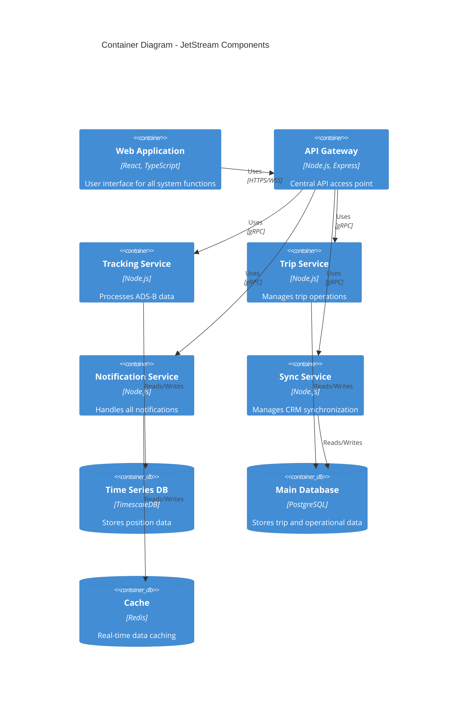

## 2.2 Component Details

### 2.2.1 Core Components

| Component | Purpose | Technology Stack | Scaling Strategy |
|-----------|---------|-----------------|------------------|
| Web Application | User interface | React, TypeScript, Material-UI | Horizontal with CDN |
| API Gateway | Request routing, authentication | Node.js, Express | Horizontal with load balancer |
| Tracking Service | ADS-B data processing | Node.js, WebSocket | Horizontal by region |
| Trip Service | Trip management logic | Node.js, gRPC | Horizontal by load |
| Notification Service | Message distribution | Node.js, WebSocket | Horizontal by channel |
| Sync Service | CRM data synchronization | Node.js, REST | Horizontal by partition |

### 2.2.2 Data Storage Components

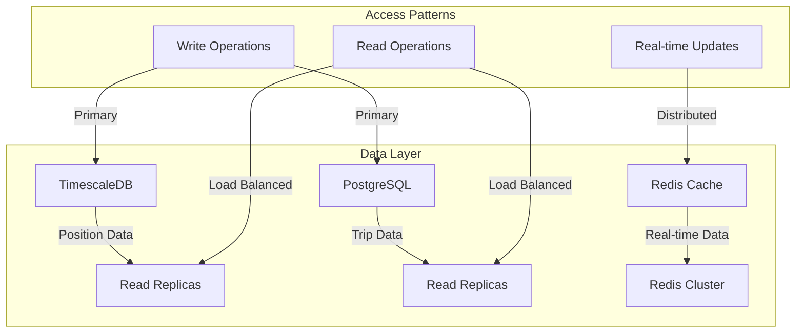

## 2.3 Technical Decisions

### 2.3.1 Architecture Patterns

| Pattern | Implementation | Justification |
|---------|---------------|---------------|
| Microservices | Domain-based service separation | Enables independent scaling and deployment |
| Event-Driven | Apache Kafka message bus | Handles real-time updates and async processing |
| CQRS | Separate read/write paths | Optimizes for different access patterns |
| API Gateway | Single entry point | Centralizes authentication and routing |

### 2.3.2 Communication Patterns

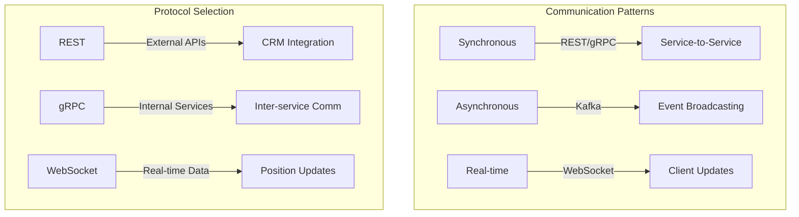

## 2.4 Cross-Cutting Concerns

### 2.4.1 Monitoring and Observability

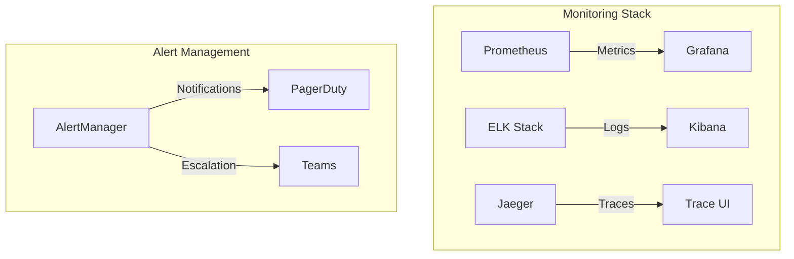

### 2.4.2 Security Architecture

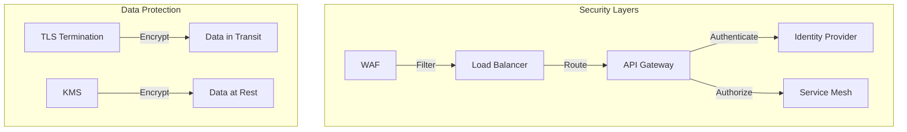

## 2.5 Deployment Architecture

```mermaid
C4Deployment
    title Deployment Diagram - JetStream Infrastructure

    Deployment_Node(az1, "Azure Region 1", "Primary"){
        Deployment_Node(k8s1, "AKS Cluster"){
            Container(web1, "Web Application", "React")
            Container(api1, "API Gateway", "Node.js")
            Container(svc1, "Microservices", "Node.js")
        }
        Deployment_Node(data1, "Data Layer"){
            ContainerDb(db1, "Primary Database", "PostgreSQL")
            ContainerDb(ts1, "Time Series DB", "TimescaleDB")
            ContainerDb(cache1, "Cache", "Redis")
        }
    }

    Deployment_Node(az2, "Azure Region 2", "Secondary"){
        Deployment_Node(k8s2, "AKS Cluster"){
            Container(web2, "Web Application", "React")
            Container(api2, "API Gateway", "Node.js")
            Container(svc2, "Microservices", "Node.js")
        }
        Deployment_Node(data2, "Data Layer"){
            ContainerDb(db2, "Replica Database", "PostgreSQL")
            ContainerDb(ts2, "Time Series Replica", "TimescaleDB")
            ContainerDb(cache2, "Cache", "Redis")
        }
    }

    Rel(az1, az2, "Replication")
```

# 3. SYSTEM COMPONENTS ARCHITECTURE

## 3.1 User Interface Design

### 3.1.1 Design System Specifications

| Category | Requirements |
|----------|--------------|
| Visual Hierarchy | - Primary actions prominently displayed<br>- Critical information highlighted<br>- Status indicators with clear color coding |
| Component Library | Material-UI v5 with custom aviation theme |
| Responsive Breakpoints | - Mobile: 320px - 480px<br>- Tablet: 481px - 1024px<br>- Desktop: 1025px+ |
| Accessibility | WCAG 2.1 Level AA compliance |
| Browser Support | Latest 2 versions of Chrome, Firefox, Safari, Edge |
| Theme Support | Light/Dark mode with system preference detection |
| Internationalization | English (US) primary, extensible for future languages |

### 3.1.2 Core Interface Components

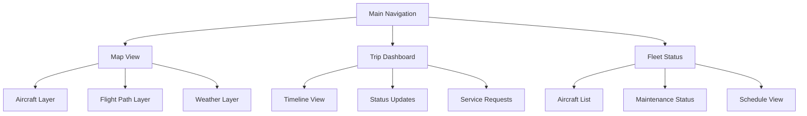

### 3.1.3 Critical User Flows

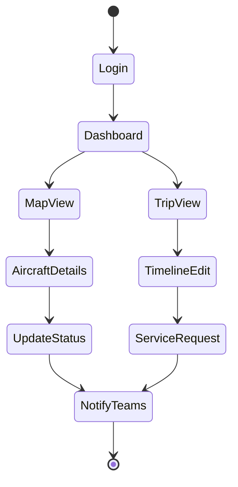

## 3.2 Database Design

### 3.2.1 Schema Design

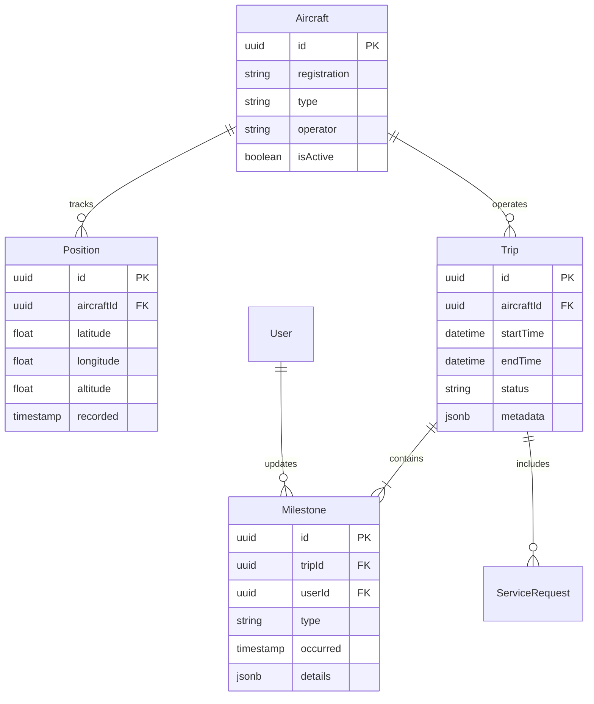

### 3.2.2 Data Management Strategy

| Aspect | Implementation |
|--------|---------------|
| Partitioning | Time-based partitioning for position data |
| Indexing | - B-tree indexes on lookup columns<br>- GiST indexes for spatial data<br>- Partial indexes for active records |
| Archival | - 90-day retention for position data<br>- 7-year retention for trip data<br>- Monthly archival to cold storage |
| Backup | - Continuous WAL archiving<br>- Daily full backups<br>- Cross-region replication |
| Encryption | - TDE for data at rest<br>- Column-level encryption for PII |

## 3.3 API Design

### 3.3.1 API Architecture

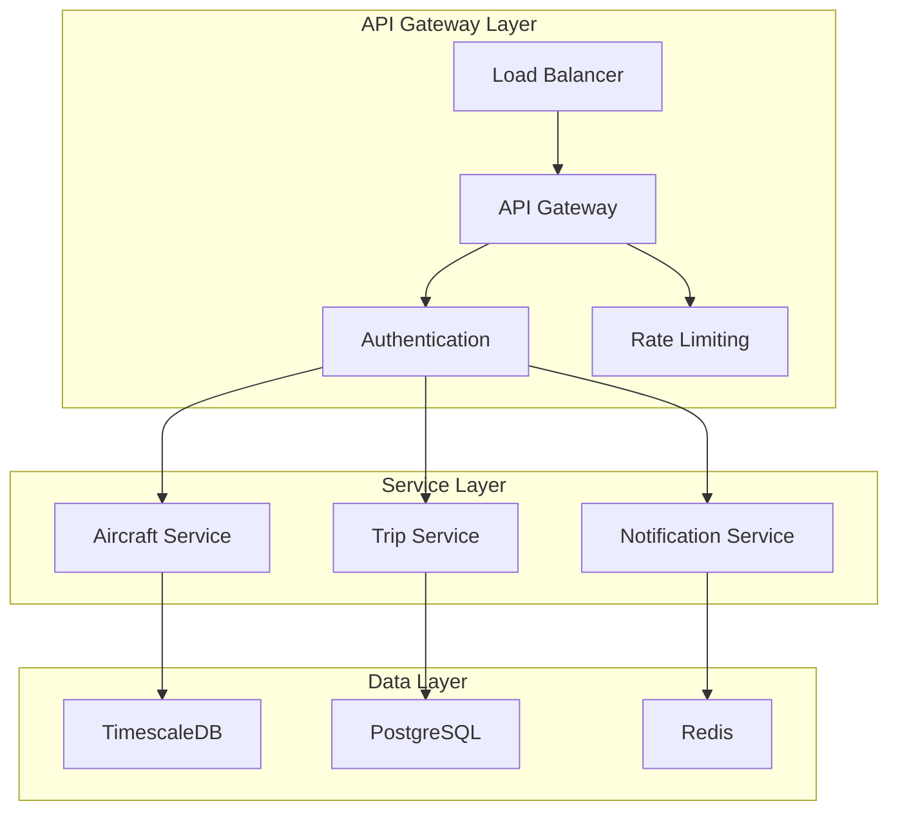

### 3.3.2 API Specifications

| Endpoint | Method | Purpose | Rate Limit |
|----------|--------|---------|------------|
| /api/v1/aircraft | GET | List all aircraft | 100/min |
| /api/v1/aircraft/{id}/position | GET | Get current position | 300/min |
| /api/v1/trips | POST | Create new trip | 50/min |
| /api/v1/trips/{id}/status | PATCH | Update trip status | 100/min |
| /api/v1/notifications | POST | Send notification | 200/min |

### 3.3.3 Integration Patterns

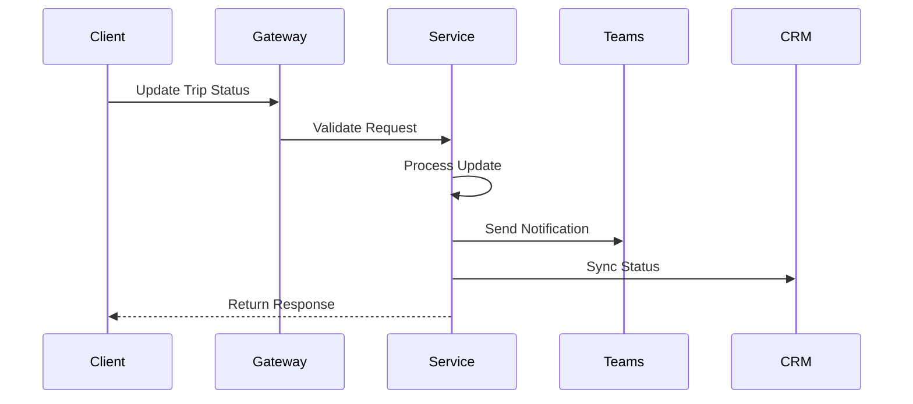

### 3.3.4 Security Controls

| Control | Implementation |
|---------|---------------|
| Authentication | OAuth 2.0 with JWT |
| Authorization | RBAC with scope-based permissions |
| Rate Limiting | Token bucket algorithm per API key |
| Input Validation | JSON Schema validation |
| Output Sanitization | Content-Security-Policy headers |
| Encryption | TLS 1.3 with perfect forward secrecy |

# 4. TECHNOLOGY STACK

## 4.1 PROGRAMMING LANGUAGES

| Platform/Component | Language | Version | Justification |
|-------------------|----------|---------|---------------|
| Frontend | TypeScript | 5.0+ | - Strong typing for complex trip management<br>- Enhanced IDE support<br>- Better maintainability for large codebase |
| Backend Services | Node.js | 20 LTS | - Excellent real-time capabilities for WebSocket<br>- Large ecosystem for aviation data processing<br>- Consistent JavaScript/TypeScript stack |
| Data Processing | Node.js | 20 LTS | - Efficient stream processing for ADS-B data<br>- Native JSON handling<br>- Async processing capabilities |

## 4.2 FRAMEWORKS & LIBRARIES

### Frontend Core

| Framework | Version | Purpose | Justification |
|-----------|---------|---------|---------------|
| React | 18.2+ | UI Framework | - Component reusability for complex interfaces<br>- Virtual DOM for real-time updates<br>- Extensive ecosystem |
| Material-UI | 5.x | Component Library | - Aviation-themed customization<br>- Accessibility compliance<br>- Responsive design support |
| MapboxGL | 2.x | Map Visualization | - Custom layer support for aircraft tracking<br>- Real-time update capability<br>- Offline map support |

### Backend Core

| Framework | Version | Purpose | Justification |
|-----------|---------|---------|---------------|
| Express | 4.x | API Gateway | - Robust routing<br>- Middleware ecosystem<br>- Easy integration with Teams |
| gRPC | 1.x | Service Communication | - Efficient inter-service communication<br>- Strong typing with protobuf<br>- Bidirectional streaming |
| Socket.io | 4.x | Real-time Updates | - WebSocket with fallback support<br>- Room-based broadcasting<br>- Client reconnection handling |

## 4.3 DATABASES & STORAGE

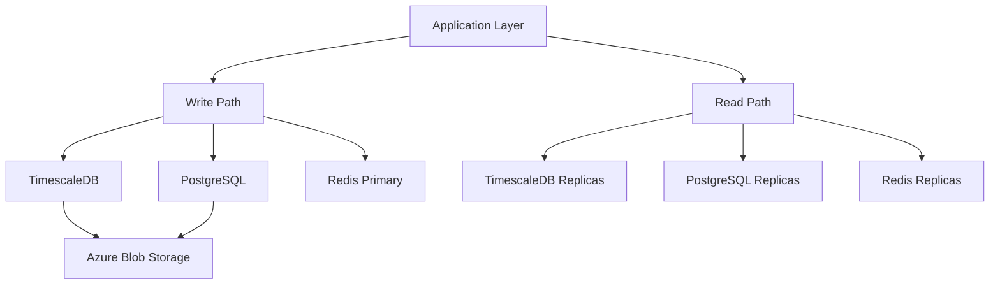

| Database | Version | Purpose | Configuration |
|----------|---------|---------|---------------|
| TimescaleDB | 2.x | Position Data | - Automated partitioning<br>- Continuous aggregation<br>- Compression enabled |
| PostgreSQL | 15.x | Operational Data | - Synchronous replication<br>- PITR enabled<br>- WAL archiving |
| Redis | 7.x | Real-time Cache | - Cluster mode<br>- AOF persistence<br>- Sentinel monitoring |

## 4.4 THIRD-PARTY SERVICES

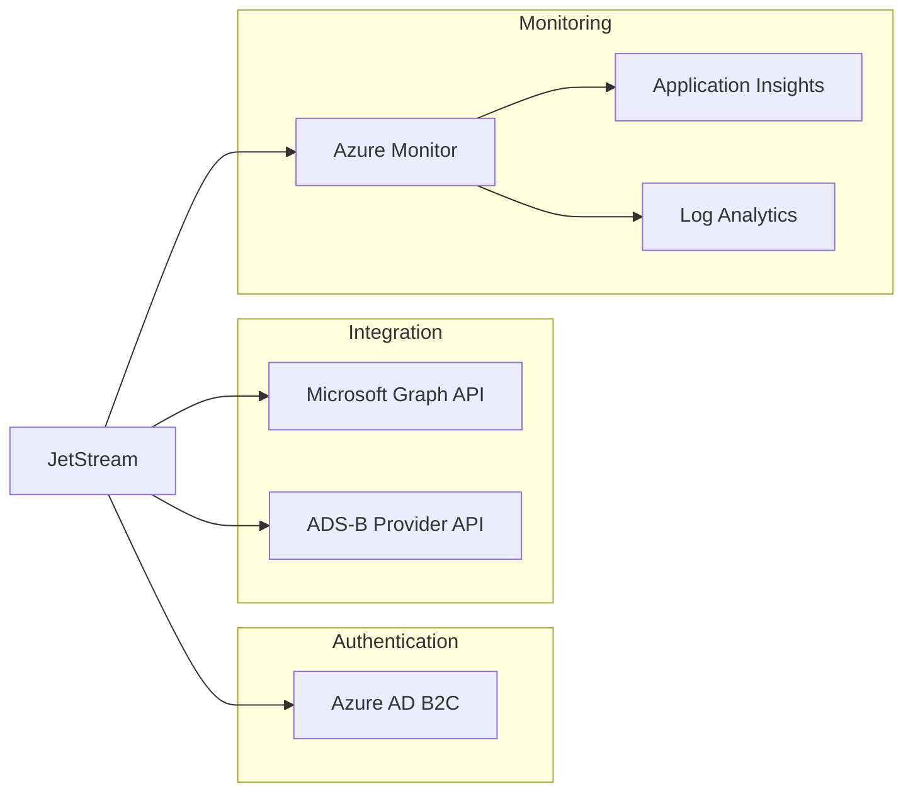

| Service | Purpose | Integration Method |
|---------|---------|-------------------|
| Azure AD B2C | Authentication | OAuth 2.0/OIDC |
| Microsoft Graph API | Teams Integration | REST/OAuth 2.0 |
| ADS-B Data Provider | Aircraft Tracking | REST/API Key |
| Azure Monitor | System Monitoring | SDK Integration |
| Application Insights | Performance Monitoring | Auto-instrumentation |

## 4.5 DEVELOPMENT & DEPLOYMENT

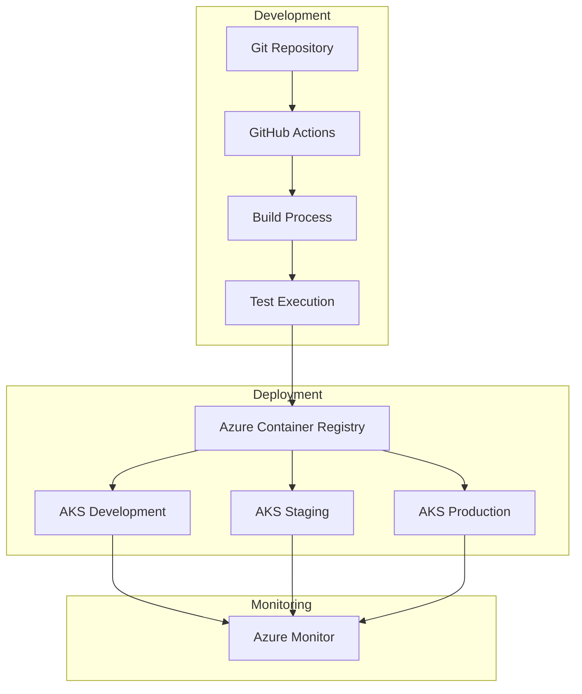

### Development Tools

| Category | Tool | Version | Purpose |
|----------|------|---------|----------|
| IDE | VS Code | Latest | Primary development environment |
| Version Control | Git | 2.x+ | Source code management |
| API Testing | Postman | Latest | API development and testing |
| Container Runtime | Docker | 24.x | Local development containers |

### Build & Deployment

| Tool | Version | Configuration |
|------|---------|---------------|
| Azure DevOps | Cloud | - Multi-stage pipelines<br>- Environment promotion<br>- Automated testing |
| Helm | 3.x | - Kubernetes deployment<br>- Environment configuration<br>- Release management |
| Azure Container Registry | Cloud | - Container image storage<br>- Vulnerability scanning<br>- Image signing |
| Azure Kubernetes Service | Cloud | - Multi-region deployment<br>- Auto-scaling<br>- Blue-green deployments |

# 5. SYSTEM DESIGN

## 5.1 User Interface Design

### 5.1.1 Layout Structure

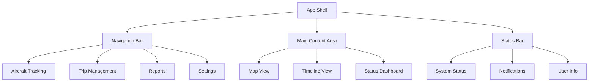

### 5.1.2 Core Screen Layouts

| Screen | Primary Components | Key Features |
|--------|-------------------|--------------|
| Map View | - Interactive map<br>- Aircraft overlay<br>- Flight path visualization<br>- Status filters | - Real-time position updates<br>- Click-to-track functionality<br>- Path prediction display<br>- Weather layer toggle |
| Trip Dashboard | - Timeline display<br>- Status update panel<br>- Service requests<br>- Communication log | - Drag-drop timeline editing<br>- Quick status updates<br>- Integrated messaging<br>- Document attachments |
| Status Board | - Fleet overview<br>- Active trips grid<br>- Alert indicators<br>- Performance metrics | - Real-time updates<br>- Priority highlighting<br>- Click-through details<br>- Export capabilities |

### 5.1.3 Interaction Flows

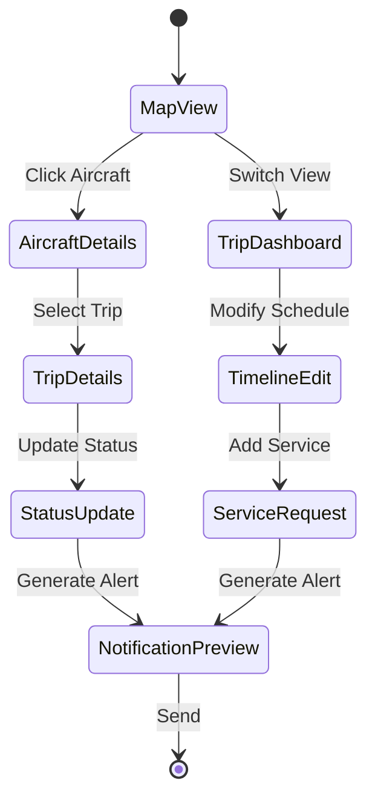

## 5.2 Database Design

### 5.2.1 Schema Design


### 5.2.2 Data Management Strategy

| Aspect | Implementation |
|--------|---------------|
| Partitioning | Time-based partitioning for position data |
| Indexing | - B-tree indexes on lookup columns<br>- GiST indexes for spatial data<br>- Partial indexes for active records |
| Archival | - 90-day retention for position data<br>- 7-year retention for trip data<br>- Monthly archival to cold storage |
| Backup | - Continuous WAL archiving<br>- Daily full backups<br>- Cross-region replication |
| Encryption | - TDE for data at rest<br>- Column-level encryption for PII |

## 5.3 API Design

### 5.3.1 API Architecture


### 5.3.2 API Specifications

| Endpoint | Method | Purpose | Rate Limit |
|----------|--------|---------|------------|
| /api/v1/aircraft | GET | List all aircraft | 100/min |
| /api/v1/aircraft/{id}/position | GET | Get current position | 300/min |
| /api/v1/trips | POST | Create new trip | 50/min |
| /api/v1/trips/{id}/status | PATCH | Update trip status | 100/min |
| /api/v1/notifications | POST | Send notification | 200/min |

### 5.3.3 Integration Patterns


### 5.3.4 Security Controls

| Control | Implementation |
|---------|---------------|
| Authentication | OAuth 2.0 with JWT |
| Authorization | RBAC with scope-based permissions |
| Rate Limiting | Token bucket algorithm per API key |
| Input Validation | JSON Schema validation |
| Output Sanitization | Content-Security-Policy headers |
| Encryption | TLS 1.3 with perfect forward secrecy |

# 6. USER INTERFACE DESIGN

## 6.1 Design System

### 6.1.1 Icon Key
```
[#] Dashboard/Menu    [?] Help/Info      [!] Alert/Warning
[@] User/Profile     [$] Financial       [i] Information
[+] Add/Create       [x] Close/Delete    [^] Upload
[<] Previous         [>] Next            [=] Settings
[*] Important        [v] Dropdown        [ ] Checkbox
```

### 6.1.2 Layout Grid
```
+------------------+------------------+------------------+
|     Header       |    Search        |   User Menu     |
+------------------+------------------+------------------+
|                  |                                    |
|  Navigation      |        Main Content               |
|                  |                                    |
|                  |                                    |
+------------------+------------------------------------+
```

## 6.2 Core Screens

### 6.2.1 Main Dashboard
```
+--------------------------------------------------------+
| JetStream [#]                        [@User] [?] [=]    |
+--------------------------------------------------------+
| [Search Aircraft/Trip...]                               |
+--------------------------------------------------------+
| ACTIVE FLIGHTS (3)                     [+ New Trip]     |
|                                                        |
| N123AB  KBOS -> KLAX  [!] Delayed                     |
| +-- ETD: 14:30 EDT    Status: Boarding                |
| +-- Catering: [=====>    ] 60%                        |
|                                                        |
| N456CD  KJFK -> KLAS                                  |
| +-- ETD: 15:15 EDT    Status: In Position             |
| +-- Ground Transport: [==========] 100%                |
|                                                        |
| N789EF  KMIA -> KSFO  [*] VIP                         |
| +-- ETD: 15:45 EDT    Status: Enroute                 |
| +-- ETA: 18:30 PDT    [=========>] 90%                |
+--------------------------------------------------------+
```

### 6.2.2 Aircraft Tracking Map
```
+--------------------------------------------------------+
| Map Controls    Weather [v]   Layers [v]   Filters [v]  |
+--------------------------------------------------------+
|                              N123AB                     |
|                                 |                       |
|                                 |                       |
|           KBOS -------- + ---- + ----- KLAX           |
|            [*]          |       \                      |
|                         |        \                     |
|                      N456CD      N789EF               |
|                                                        |
| +---------------+ Legend:                              |
| | [*] Base      |  ---- Planned Route                 |
| | [!] Delayed   |  .... Actual Route                  |
| | [>] Enroute   |  [+] Current Position              |
| +---------------+                                      |
+--------------------------------------------------------+
```

### 6.2.3 Trip Status Update
```
+--------------------------------------------------------+
| Trip: T123-456                        [x] Close         |
+--------------------------------------------------------+
| Status Update                     Current: In Position   |
+--------------------------------------------------------+
| Select New Status: [v]                                  |
| ( ) Aircraft Not in Position                            |
| ( ) Aircraft in Position                                |
| (•) Crew Ready for Passengers                          |
| ( ) Passengers in Sight                                 |
| ( ) Passengers Onboard                                  |
|                                                        |
| Additional Notes:                                      |
| [...................................................] |
|                                                        |
| Notify: [x] Operations  [x] Sales  [ ] Management     |
|                                                        |
| [Cancel]                           [Update Status]     |
+--------------------------------------------------------+
```

### 6.2.4 Service Coordination
```
+--------------------------------------------------------+
| Service Requests: N123AB                                |
+--------------------------------------------------------+
| Catering                                               |
| +-- Vendor: Sky Catering [v]                           |
| +-- Time: [14:00 EDT v]                                |
| +-- Status: [Confirmed v]                              |
| +-- Notes: [.......................................] |
|                                                        |
| Ground Transportation                                  |
| +-- Vendor: Elite Cars [v]                            |
| +-- Time: [14:15 EDT v]                               |
| +-- Status: [En Route v]                              |
| +-- Notes: [.......................................] |
|                                                        |
| [+ Add Service Request]        [Save Changes]          |
+--------------------------------------------------------+
```

## 6.3 Responsive Design Breakpoints

### 6.3.1 Mobile View (320px - 480px)
```
+--------------------+
| [=] JetStream [@] |
+--------------------+
| [Search...]        |
+--------------------+
| Active Flights (3) |
| +-- N123AB        |
| |   KBOS -> KLAX  |
| |   [!] Delayed   |
| +-- N456CD        |
| |   KJFK -> KLAS  |
| +-- N789EF        |
|     KMIA -> KSFO  |
+--------------------+
```

### 6.3.2 Tablet View (481px - 1024px)
```
+--------------------------------+
| [=] JetStream    [Search] [@] |
+--------------------------------+
| Map View         | Flight List |
|                 | N123AB [!]  |
|    KBOS [*]     | N456CD     |
|        \        | N789EF [*] |
|         \       |            |
|          KLAX   |            |
|                 |            |
+--------------------------------+
```

## 6.4 Interaction States

### 6.4.1 Button States
```
Normal:    [Update Status]
Hover:     [Update Status]
Active:    [Update Status]
Disabled:  [Update Status]
Loading:   [Updating... ===>]
```

### 6.4.2 Form Validation
```
Valid:     [......................]
Invalid:   [......................]  [!] Required field
Error:     [......................]  [!] Invalid format
Success:   [......................]  [✓] Saved
```

### 6.4.3 Notifications
```
Success:   [✓] Status updated successfully
Warning:   [!] Unsaved changes present
Error:     [!] Failed to update status
Info:      [i] New flight added to schedule
```

# 7. SECURITY CONSIDERATIONS

## 7.1 Authentication and Authorization

### 7.1.1 Authentication Flow

```mermaid
sequenceDiagram
    participant User
    participant App
    participant Gateway
    participant AzureAD
    participant Services
    
    User->>App: Access Request
    App->>Gateway: Redirect to Auth
    Gateway->>AzureAD: OAuth2 Request
    AzureAD-->>User: Login Prompt
    User->>AzureAD: Credentials
    AzureAD-->>Gateway: JWT Token
    Gateway->>Services: Validated Request
    Services-->>App: Protected Resource
```

### 7.1.2 Authorization Matrix

| Role | Aircraft Tracking | Trip Management | Service Requests | Admin Functions |
|------|------------------|-----------------|------------------|-----------------|
| Operations | Full Access | Full Access | Create/Update | View Only |
| Sales | View Only | View Only | View Only | No Access |
| Customer Service | View Only | View Status | Create Only | No Access |
| Management | View Only | View Only | View Only | View Only |
| System Admin | Full Access | Full Access | Full Access | Full Access |

## 7.2 Data Security

### 7.2.1 Data Classification

| Data Type | Classification | Encryption | Access Control |
|-----------|---------------|------------|----------------|
| Aircraft Position | Sensitive | AES-256 in transit and at rest | Role-based |
| Trip Details | Confidential | AES-256 in transit and at rest | Role-based + MFA |
| Customer Information | Restricted | AES-256 with key rotation | Role-based + MFA |
| System Logs | Internal | AES-256 in transit and at rest | Admin Only |
| Public Data | Public | TLS in transit | Authenticated |

### 7.2.2 Encryption Architecture

```mermaid
flowchart TD
    A[Data Source] -->|TLS 1.3| B[API Gateway]
    B -->|AES-256| C[Application Layer]
    C -->|TLS 1.3| D[Database Layer]
    
    subgraph "Key Management"
        E[Azure Key Vault] -->|Rotation| F[Encryption Keys]
        F -->|Access| C
        F -->|Access| D
    end
    
    subgraph "Data at Rest"
        D -->|TDE| G[PostgreSQL]
        D -->|TDE| H[TimescaleDB]
        D -->|Encryption| I[Redis]
    end
```

## 7.3 Security Protocols

### 7.3.1 Network Security

| Layer | Protocol | Implementation |
|-------|----------|----------------|
| Transport | TLS 1.3 | Perfect Forward Secrecy |
| API | OAuth 2.0 + JWT | Azure AD B2C integration |
| Service Mesh | mTLS | Service-to-service encryption |
| Database | TDE | Azure-managed encryption |
| Cache | Redis AUTH | Protected instance with encryption |

### 7.3.2 Security Monitoring

```mermaid
flowchart LR
    A[Security Events] -->|Log Collection| B[Azure Monitor]
    B -->|Analysis| C[Security Center]
    B -->|Alerts| D[PagerDuty]
    
    subgraph "Security Controls"
        E[WAF] -->|Filter| F[Load Balancer]
        F -->|Protect| G[Applications]
        H[SIEM] -->|Monitor| G
    end
    
    subgraph "Response"
        C -->|Trigger| I[Security Playbooks]
        D -->|Alert| J[Security Team]
    end
```

### 7.3.3 Security Compliance Requirements

| Requirement | Implementation | Validation |
|-------------|----------------|------------|
| SOC 2 Type II | Continuous monitoring | Quarterly audits |
| GDPR | Data privacy controls | Annual assessment |
| CCPA | Data handling procedures | Bi-annual review |
| ISO 27001 | Security management | Annual certification |
| Aviation Standards | FAA/EASA compliance | Regular audits |

### 7.3.4 Security Controls Matrix

| Control Type | Control | Implementation |
|-------------|---------|----------------|
| Preventive | Access Control | Azure AD B2C with MFA |
| Detective | Audit Logging | ELK Stack with retention |
| Corrective | Incident Response | Automated playbooks |
| Deterrent | Session Management | 30-minute timeout |
| Recovery | Backup Systems | Cross-region replication |
| Compensating | Manual Reviews | Weekly security checks |

### 7.3.5 Vulnerability Management

```mermaid
flowchart TD
    A[Vulnerability Scanner] -->|Daily Scan| B[Security Assessment]
    B -->|Triage| C[Risk Assessment]
    C -->|High Risk| D[Immediate Patching]
    C -->|Medium Risk| E[Scheduled Patching]
    C -->|Low Risk| F[Next Release]
    
    subgraph "Patch Management"
        D -->|Deploy| G[Emergency Change]
        E -->|Deploy| H[Regular Change]
        F -->|Deploy| I[Version Update]
    end
    
    subgraph "Validation"
        G -->|Verify| J[Security Testing]
        H -->|Verify| J
        I -->|Verify| J
    end
```

# 8. INFRASTRUCTURE

## 8.1 DEPLOYMENT ENVIRONMENT

### Primary Environment: Azure Cloud
```mermaid
flowchart TD
    subgraph "Production Environment"
        A[Azure Region East] -->|Active-Active| B[Azure Region West]
        
        subgraph "Region Components"
            C[AKS Cluster] --> D[Application Tier]
            C --> E[Data Tier]
            F[Azure CDN] --> G[Static Assets]
            H[Azure Cache] --> I[Redis Cluster]
        end
    end
    
    subgraph "DR Environment"
        J[Azure Region South] -->|Warm Standby| K[Backup Systems]
    end
```

| Environment Type | Purpose | Configuration |
|-----------------|---------|---------------|
| Production | Primary workload | Multi-region active-active |
| Staging | Pre-production validation | Single region with reduced capacity |
| Development | Development and testing | Minimal configuration per team |
| DR | Business continuity | Warm standby with 1-hour RTO |

## 8.2 CLOUD SERVICES

| Service | Purpose | Configuration |
|---------|---------|---------------|
| Azure Kubernetes Service (AKS) | Container orchestration | Multi-node production clusters |
| Azure Database for PostgreSQL | Primary data store | Hyperscale (Citus) for sharding |
| Azure Cache for Redis | Real-time data caching | Premium tier with geo-replication |
| Azure CDN | Static content delivery | Standard tier with custom domain |
| Azure Key Vault | Secrets management | Premium tier with HSM support |
| Azure Monitor | System monitoring | Application Insights integration |

### Service Architecture
```mermaid
flowchart LR
    subgraph "Frontend"
        A[Azure CDN] --> B[Static Web Apps]
    end
    
    subgraph "Application"
        C[AKS Cluster] --> D[API Services]
        C --> E[Processing Services]
    end
    
    subgraph "Data"
        F[Azure DB] --> G[PostgreSQL]
        H[Azure Cache] --> I[Redis]
    end
    
    subgraph "Security"
        J[Key Vault] --> K[Secrets]
        L[AD B2C] --> M[Authentication]
    end
```

## 8.3 CONTAINERIZATION

### Container Strategy

| Component | Base Image | Purpose |
|-----------|------------|----------|
| Web Application | node:20-alpine | React frontend serving |
| API Gateway | node:20-alpine | API request handling |
| Tracking Service | node:20-alpine | ADS-B data processing |
| Trip Service | node:20-alpine | Trip management logic |
| Notification Service | node:20-alpine | Teams integration |

### Container Configuration
```mermaid
flowchart TD
    subgraph "Container Architecture"
        A[Ingress Controller] --> B[API Gateway]
        B --> C[Service Mesh]
        
        C --> D[Web App]
        C --> E[Tracking Service]
        C --> F[Trip Service]
        C --> G[Notification Service]
        
        H[Config Maps] --> I[Environment Config]
        J[Secrets] --> K[Sensitive Data]
    end
```

## 8.4 ORCHESTRATION

### Kubernetes Configuration

| Resource Type | Purpose | Configuration |
|--------------|---------|---------------|
| Deployments | Application workloads | Rolling updates, auto-scaling |
| StatefulSets | Stateful services | Persistent storage, ordered deployment |
| Services | Internal networking | ClusterIP, LoadBalancer types |
| Ingress | External access | SSL termination, routing rules |
| ConfigMaps | Configuration | Environment-specific settings |
| Secrets | Sensitive data | Encrypted storage |

### Cluster Architecture
```mermaid
flowchart TD
    subgraph "AKS Cluster"
        A[Ingress Controller] --> B[Service Mesh]
        
        subgraph "Application Nodes"
            B --> C[Web Pods]
            B --> D[API Pods]
            B --> E[Service Pods]
        end
        
        subgraph "Data Nodes"
            F[Storage Classes] --> G[Persistent Volumes]
            H[Stateful Workloads] --> I[Databases]
        end
        
        J[Autoscaler] --> K[Node Pools]
    end
```

## 8.5 CI/CD PIPELINE

### Pipeline Stages
```mermaid
flowchart LR
    A[Source] --> B[Build]
    B --> C[Test]
    C --> D[Security Scan]
    D --> E[Artifact Push]
    E --> F[Deploy Dev]
    F --> G[Deploy Stage]
    G --> H[Deploy Prod]
    
    subgraph "Quality Gates"
        I[Unit Tests]
        J[Integration Tests]
        K[Security Checks]
    end
```

### Pipeline Configuration

| Stage | Tools | Purpose |
|-------|-------|---------|
| Source Control | Git, GitHub | Version control, code hosting |
| Build | Azure Pipelines | Container image building |
| Test | Jest, Cypress | Automated testing |
| Security | SonarQube, OWASP | Code and dependency scanning |
| Artifact | Azure Container Registry | Image repository |
| Deployment | Helm, Flux | Kubernetes deployment |
| Monitoring | Azure Monitor | Deployment health checks |

### Environment Promotion
```mermaid
flowchart TD
    subgraph "Development"
        A[Feature Branch] --> B[Dev Build]
        B --> C[Dev Deploy]
    end
    
    subgraph "Staging"
        D[Release Branch] --> E[Stage Build]
        E --> F[Stage Deploy]
    end
    
    subgraph "Production"
        G[Main Branch] --> H[Prod Build]
        H --> I[Prod Deploy]
    end
    
    C --> E
    F --> H
```

# APPENDICES

## A.1 ADDITIONAL TECHNICAL INFORMATION

### A.1.1 ADS-B Data Processing Flow

```mermaid
flowchart TD
    A[ADS-B Feed] -->|Raw Data| B[Data Ingestion Service]
    B -->|Validation| C[Position Processor]
    C -->|Clean Data| D[Position Service]
    
    D -->|Real-time| E[Redis Cache]
    D -->|Storage| F[TimescaleDB]
    
    E -->|5s Updates| G[Map Interface]
    F -->|Historical| H[Analytics Engine]
    
    subgraph "Data Quality"
        I[Validation Rules] --> B
        J[Position Filters] --> C
        K[Accuracy Checks] --> D
    end
```

### A.1.2 Teams Integration Architecture

```mermaid
flowchart LR
    A[Status Update] -->|Event| B[Notification Service]
    B -->|Format| C[Teams Template]
    C -->|Graph API| D[Teams Channel]
    
    subgraph "Message Flow"
        E[Trip Details] --> F[Status Change]
        F --> G[User Attribution]
        G --> H[Timestamp]
    end
    
    D -->|Delivery| I[Operations]
    D -->|Delivery| J[Sales]
    D -->|Delivery| K[Customer Service]
```

## A.2 GLOSSARY

| Term | Definition |
|------|------------|
| Active-Active Deployment | System architecture where multiple instances run simultaneously, sharing workload |
| Blue-Green Deployment | Deployment strategy using two identical environments for zero-downtime updates |
| Extended Squitter | Enhanced ADS-B message format containing additional aircraft information |
| Flight Following | Process of monitoring aircraft throughout its journey |
| Hyperscale | Database architecture supporting horizontal scaling across multiple nodes |
| Service Mesh | Infrastructure layer handling service-to-service communication |
| Time-series Data | Data points indexed in chronological order |
| Warm Standby | Disaster recovery configuration with partially-active backup systems |

## A.3 ACRONYMS

| Acronym | Full Form |
|---------|-----------|
| AKS | Azure Kubernetes Service |
| AOF | Append-Only File (Redis) |
| CDN | Content Delivery Network |
| CQRS | Command Query Responsibility Segregation |
| DR | Disaster Recovery |
| HSM | Hardware Security Module |
| IDE | Integrated Development Environment |
| KMS | Key Management Service |
| PITR | Point-In-Time Recovery |
| RTO | Recovery Time Objective |
| RPO | Recovery Point Objective |
| SLA | Service Level Agreement |
| TDE | Transparent Data Encryption |
| WAF | Web Application Firewall |
| WAL | Write-Ahead Logging |

## A.4 SYSTEM METRICS

| Category | Metric | Target |
|----------|--------|--------|
| Performance | API Response Time | < 200ms (p95) |
| Performance | Map Rendering Time | < 1s initial, < 100ms updates |
| Performance | Database Query Time | < 100ms (p95) |
| Availability | System Uptime | 99.9% |
| Availability | API Availability | 99.95% |
| Reliability | Error Rate | < 0.1% |
| Scalability | Concurrent Users | 500+ |
| Scalability | Requests per Second | 1000+ |
| Security | Authentication Time | < 500ms |
| Security | Session Duration | 30 minutes |

## A.5 COMPLIANCE MATRIX

```mermaid
graph TD
    subgraph "Compliance Requirements"
        A[Aviation Standards] --> B[FAA Compliance]
        A --> C[EASA Compliance]
        
        D[Data Privacy] --> E[GDPR]
        D --> F[CCPA]
        
        G[Security] --> H[ISO 27001]
        G --> I[SOC 2]
        
        J[Accessibility] --> K[WCAG 2.1]
    end
    
    subgraph "Implementation"
        L[Technical Controls]
        M[Process Controls]
        N[Documentation]
    end
    
    B & C & E & F & H & I & K --> L & M & N
```