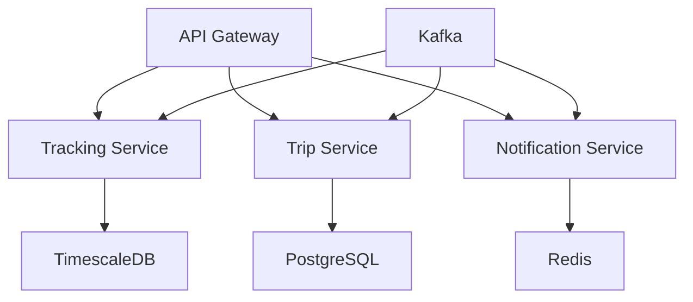

# JetStream Backend Services

## Overview

JetStream is a next-generation aircraft tracking and trip management platform built with a microservices architecture using Node.js, TypeScript, and modern cloud-native technologies.



## Prerequisites

- Node.js >= 20.0.0
- npm >= 9.0.0
- Docker & Docker Compose
- Git

## Getting Started

1. Clone the repository:
```bash
git clone https://github.com/flyusa/jetstream.git
cd jetstream/backend
```

2. Install dependencies:
```bash
npm install
```

3. Configure environment:
```bash
cp .env.example .env
# Edit .env with your configuration
```

4. Start development environment:
```bash
docker-compose up -d
npm run dev
```

## Project Structure

```
src/
├── api-gateway/        # API Gateway service
├── services/
│   ├── tracking/      # Aircraft tracking service
│   ├── trip/          # Trip management service
│   └── notification/  # Notification service
├── common/            # Shared utilities and types
└── config/           # Configuration management
```

## Development

### Environment Setup

The development environment uses Docker Compose to provide:
- PostgreSQL for trip management
- TimescaleDB for position data
- Redis for caching
- Kafka for event streaming
- ZooKeeper for Kafka coordination

### Running Services

Start all services:
```bash
docker-compose up -d
```

Start specific service:
```bash
docker-compose up -d api-gateway
```

### Development Workflow

1. Start development server:
```bash
npm run dev
```

2. Run tests:
```bash
npm test
npm run test:watch    # Watch mode
npm run test:coverage # Coverage report
```

3. Linting and formatting:
```bash
npm run lint
npm run format
```

## API Documentation

API documentation is available at `/api/docs` when running the development server.

### Key Endpoints

- `/api/v1/aircraft` - Aircraft tracking endpoints
- `/api/v1/trips` - Trip management endpoints
- `/api/v1/notifications` - Notification endpoints

## Security

### Authentication

- OAuth 2.0 with Azure AD B2C
- JWT token validation
- Role-based access control

### Authorization Matrix

| Role | Aircraft Tracking | Trip Management | Notifications |
|------|------------------|-----------------|---------------|
| Operations | Full access | Full access | Full access |
| Sales | Read only | Read only | Read only |
| Service | Read only | Read/Write | Read/Write |

## Deployment

### Production Build

```bash
npm run build
```

### Container Build

```bash
docker build -t jetstream-backend .
```

### Environment Variables

Critical environment variables:
- `NODE_ENV` - Environment (development/production)
- `PORT` - API Gateway port
- `LOG_LEVEL` - Logging level
- `AZURE_AD_TENANT_ID` - Azure AD tenant ID
- `AZURE_AD_CLIENT_ID` - Azure AD client ID

## Monitoring

- Health check endpoint: `/health`
- Metrics endpoint: `/metrics`
- Prometheus integration
- Application Insights monitoring

## Troubleshooting

### Common Issues

1. Database Connection Issues
```bash
docker-compose logs postgres
docker-compose logs timescaledb
```

2. Service Discovery Problems
```bash
docker-compose ps
docker-compose logs api-gateway
```

### Debug Mode

Enable debug logging:
```bash
LOG_LEVEL=debug npm run dev
```

## Contributing

1. Create feature branch:
```bash
git checkout -b feature/your-feature-name
```

2. Commit changes:
```bash
git commit -m "feat: your feature description"
```

3. Push changes:
```bash
git push origin feature/your-feature-name
```

4. Create pull request

### Code Style

- Follow TypeScript best practices
- Use ESLint configuration
- Write unit tests for new features
- Update documentation

## License

UNLICENSED - Proprietary software of FlyUSA

---

Last Updated: 2024
Version: 1.0.0
Maintainers: Development Team